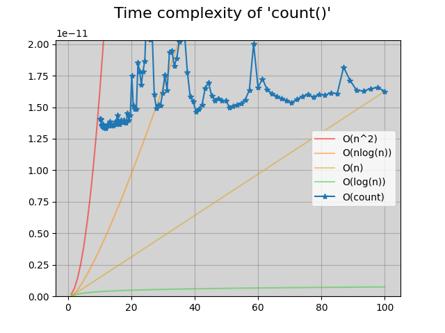

# big-O-python
This project assesses the time complexity of various built in Python functions. The program will display a plot of the time to run a function vs the size of the input, and compares that against some common Big O approximate times. The common times are O(n2), O(n * log(n)), O(n), and O(log(n)).

`python3 main.py count`

---

_Contents:_
**[Installation](#installation)** |
**[Use](#use)** |
**[Example Output](#example-output)** |

---

## Installation
`pip3 install -r requirements.txt`

## Use
`python3 main.py <function or module to assess>`

The program will accept either an individual function to assess or a collection of functions as organized in `funcs/`

## Example Output

