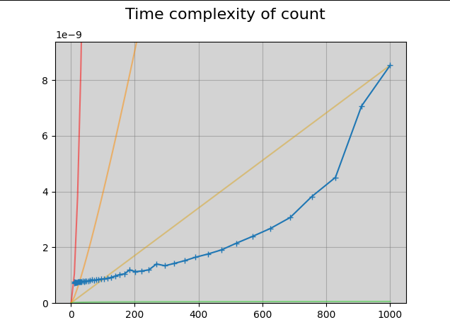

# big-O-python
An exploration of time complexity of Python functions

## Use
This repo includes a growing collection of time complexity analysis for Python functions. The program will display a plot of the time to run a function vs the size of the input, and compares that against some common Big O approximate times. The common times are O(n2), O(n * log(n)), O(n), and O(log(n)).

## Example Output

